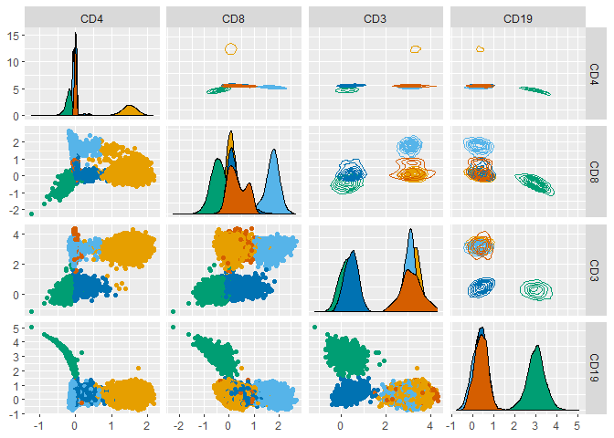

mustlinkMix
================
Ultán P. Doherty
2024-05-08

## Install `mustlinkMix`.

``` r
remotes::install_github("UltanPDoherty/mustlinkMix")
```

## Load and plot data from the `healthyFlowData` package.

``` r
library(healthyFlowData)
data(hd)
hfd1 <- hd.flowSet[[1]]@exprs

GGally::ggpairs(hfd1, upper = list(continuous = "density"), progress = FALSE)
```

<!-- -->

## Prepare a plusminus table which describes three populations.

- CD4+ T Cells (CD4+CD8-CD3+CD19-)
- CD8+ T Cells (CD4-CD8+CD3+CD19-)
- B Cells (CD4-CD8-CD3-CD19+)

``` r
plusminus1 <- as.data.frame(rbind(
  "CD4+_T" = c(+1, -1, +1, -1),
  "CD8+_T" = c(-1, +1, +1, -1),
  "B"      = c(-1, -1, -1, +1)
))
colnames(plusminus1) <- colnames(hfd1)
plusminus1
```

    ##        CD4 CD8 CD3 CD19
    ## CD4+_T   1  -1   1   -1
    ## CD8+_T  -1   1   1   -1
    ## B       -1  -1  -1    1

## Excel can be used to save or create tables (`openxlsx` package).

``` r
openxlsx::write.xlsx(
  plusminus1,
  "~/plusminus.xlsx",
  rowNames = TRUE,
  colNames = TRUE
)

plusminus2 <- openxlsx::read.xlsx(
  "~/plusminus.xlsx",
  rowNames = TRUE,
  colNames = TRUE
)
```

## Use the `gatetree` function from the `gateTree` package.

``` r
hfd1_gatetree <- gateTree::gatetree(
  hfd1,
  plusminus2,
  min_scaled_bic_diff = 50,
  min_depth = 10,
  show_plot = c(FALSE, FALSE)
)
```

## Plot the data, coloured according to the `gateTree` labels.

``` r
GGally::ggpairs(hfd1,
  progress = FALSE,
  upper = list(continuous = "density"),
  ggplot2::aes(colour = as.factor(1 + hfd1_gatetree$labels))
) +
  ggokabeito::scale_colour_okabe_ito(order = c(9, 1, 2, 3)) +
  ggokabeito::scale_fill_okabe_ito(order = c(9, 1, 2, 3))
```

<!-- -->

## Apply mustlink.

``` r
hfd1_mustlink <- mustlinkMix::mustlink(
  hfd1,
  clust_num = 4,
  zone_matrix = hfd1_gatetree$subsetter,
  zone_percent = 100,
  init_seed = 123,
  init_method = "mlkmpp"
)
```

    ## 17:51:44  E-Step Number: 10,  Log-likelihood: -25064.87475
    ## ...EM converged at 2024-05-08 17:51:44.58696

## Plot the data, coloured according to the mustlink labels.

``` r
GGally::ggpairs(hfd1,
  progress = FALSE,
  upper = list(continuous = "density"),
  ggplot2::aes(colour = as.factor(hfd1_mustlink$clust_labels))
) +
  ggokabeito::scale_colour_okabe_ito(order = c(1, 2, 3, 5)) +
  ggokabeito::scale_fill_okabe_ito(order = c(1, 2, 3, 5))
```

<!-- -->
